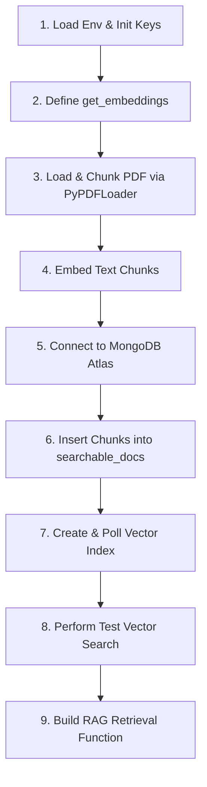

# Advanced Retrieval-Augmented Generation (RAG) with MongoDB Atlas & OpenAI

This repository contains a hands-on guide and implementation for building an **Advanced Retrieval-Augmented Generation (RAG)** pipeline. It utilizes **MongoDB Atlas Vector Search** for semantic search and retrieval, and **OpenAI's Embeddings** API to map textual data into high-dimensional vector space.

---

## 📋 Prerequisites

Before running the project, ensure you have the following:

1. **Python Environment**: Python `3.14` or higher is recommended.
2. **MongoDB Atlas Account**: You need a running MongoDB Atlas Cluster (Vector Search is an Atlas-specific feature and is not supported on self-hosted community editions).
3. **OpenAI API Key**: Access to OpenAI's models for generating embeddings.
4. **Environment Variables**: A `.env` file created in the root directory containing:
   ```env
   OPENAI_API_KEY=your_openai_api_key_here
   MONGODB_URI=your_mongodb_atlas_connection_string_here
   ```

---

## 🐍 Python Environment & Libraries

The environment can be managed via standard `pip` or using `uv` (a fast Python package installer and resolver).

### Installation

**Using `uv` (Recommended):**
```bash
uv venv
source .venv/bin/activate
uv pip install -r requirements.txt
```

**Using standard `pip`:**
```bash
python -m venv .venv
source .venv/bin/activate
pip install -r requirements.txt
```

### Core Libraries Required

The required dependencies configured in `pyproject.toml` and `requirements.txt` are:

| Library | Version | Description |
| :--- | :--- | :--- |
| **`pymongo`** | `>=4.16.0` | Official driver to connect to MongoDB and manage Vector Search indexes. |
| **`langchain`** | `>=1.2.15` | Framework for building LLM and RAG pipelines. |
| **`langchain-community`** | `>=0.4.1` | Community components, including document loaders. |
| **`langchain-openai`** | `>=1.1.12` | LangChain integrations for OpenAI APIs. |
| **`langchain-text-splitters`** | `>=1.1.1` | Used to chunk and split document texts. |
| **`openai`** | `>=2.31.0` | Official client to interact with OpenAI APIs (e.g., embeddings). |
| **`pypdf`** | `>=6.10.0` | PDF parsing library used by the document loader. |
| **`ipykernel`** | `>=7.2.0` | Required to run Python code inside the Jupyter Notebook. |

---

## 💡 RAG Concepts & Architecture

This repository covers the following foundational and advanced RAG concepts:

### 1. Document Loading & Chunking
* **PyPDFLoader**: Fetches and parses PDF documents directly from a web URL.
* **Recursive Character Text Splitting**: Chunks the documents into manageable sizes (e.g., `chunk_size=400`, `chunk_overlap=20`). This ensures semantic unity, fits within model context windows, and lowers noise during retrieval.

### 2. Semantic Embeddings
* **Asymmetric Embedding Mapping**: Distinguishes between documents to be stored (`input_type="document"`) and search queries (`input_type="query"`). This improves similarity search accuracy, mapping user questions directly to relevant answers.
* **OpenAI `text-embedding-3-large`**: Generates high-quality 3072-dimensional vector embeddings capturing the semantic nuances of text.

### 3. MongoDB Vector Search & HNSW Indexing
* **Lazy Creation**: Collection references in PyMongo are only initialized upon physical document insertion.
* **HNSW (Hierarchical Navigable Small World)**: A graph-based indexing algorithm used by MongoDB Atlas for vector indexes. It enables fast nearest-neighbor search ($O(\log N)$) rather than scanning the entire collection ($O(N)$).
* **Asynchronous Index Construction**: Vector search indexes are built by Atlas in the background; the pipeline polls Atlas until the index becomes `queryable`.

### 4. Vector Aggregation Pipeline
* **`$vectorSearch` Stage**: Atlas-specific pipeline stage that queries the HNSW index to retrieve the top $K$ documents.
* **`$project` Stage**: Filters out unnecessary data (like the massive 3072-dimensional vector arrays and database internal IDs) to retrieve only raw text, optimizing network usage and prompt context size.

---

## 🚀 Notebook Flow Walkthrough

The notebook `RAG_HandsOn_Script.ipynb` is structured step-by-step to demonstrate the RAG pipeline flow:



### Detailed Steps:

1. **Initialize API Keys**: Loads environment variables from `.env` to configure OpenAI access.
2. **Setup OpenAI Embeddings**: Creates helper utility `get_embeddings()` targeting the `text-embedding-3-large` model.
3. **Ingest and Chunk PDF**: Retrieves a financial document from MongoDB's public investor relations site, splits it using the text splitter, and creates overlap-aware documents.
4. **Prepare Payload**: Generates embeddings for each document chunk, formatting them with fields `text` and `embedding`.
5. **MongoDB Client Connection**: Establishes a connection to MongoDB Atlas and references the database/collection.
6. **Data Insertion**: Inserts chunks in bulk via `insert_many()`.
7. **Create Vector Search Index**: Submits a `SearchIndexModel` mapping `embedding` (3072 dimensions, Cosine similarity) under the name `vector_index`. It runs a polling loop until Atlas indicates `queryable = True`.
8. **Vector Query Execution**: Uses the `$vectorSearch` aggregation stage to run manual semantic searches against the collection.
9. **Build Retrieval Component**: Implements `get_query_results(query)` to wrap query embedding, the search pipeline, projection optimization, and cursor list conversion.
